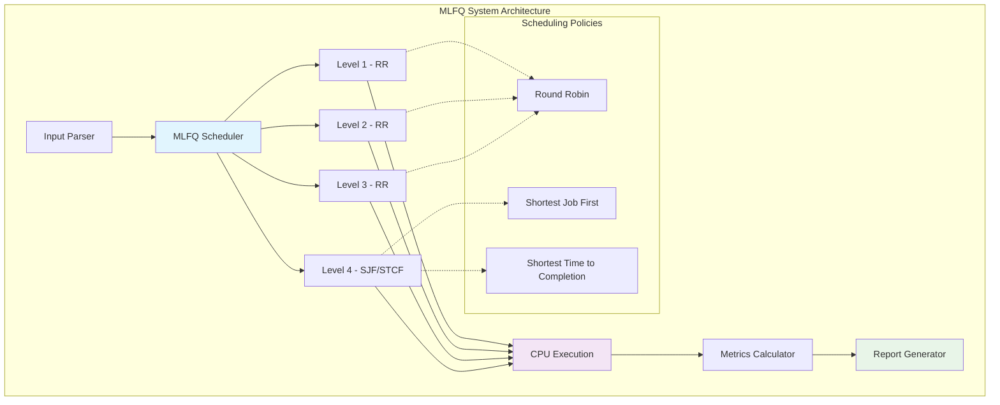
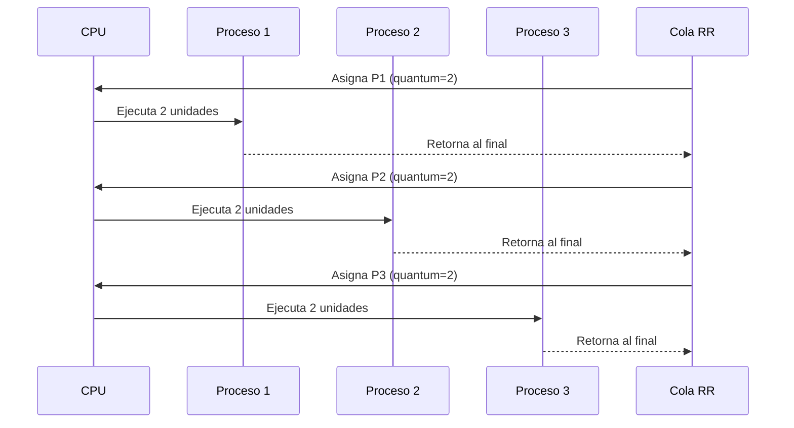
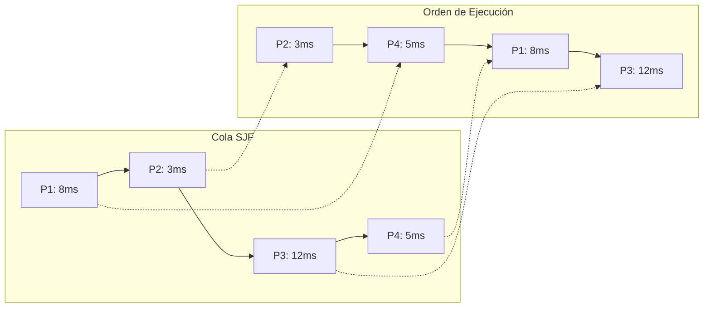
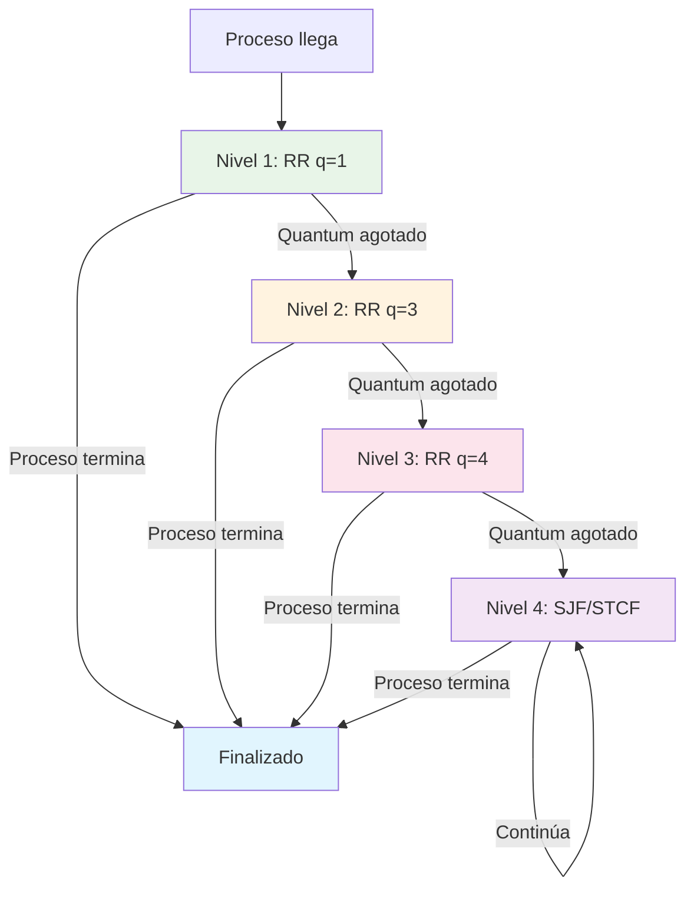
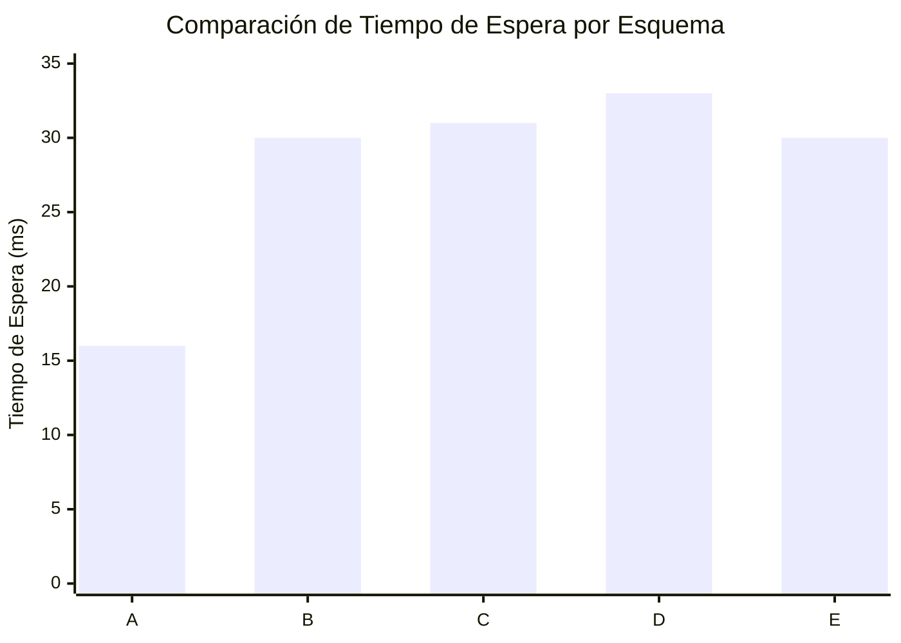
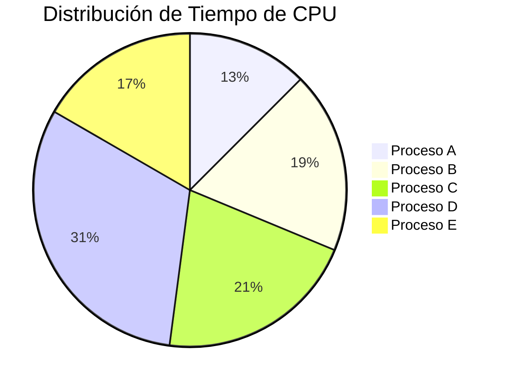

# 🚀 Simulador de Algoritmo MLFQ (Multi-Level Feedback Queue)

## 📋 Tabla de Contenidos

- [🎯 Descripción General](#-descripción-general)
- [📋 Infome](#-informe)
- [🎥 Video Explicativo](#-video-explicativo)
- [🏗️ Arquitectura del Sistema](#️-arquitectura-del-sistema)
- [📚 Algoritmos Implementados](#-algoritmos-implementados)
- [🔧 Instalación y Compilación](#-instalación-y-compilación)
- [📖 Guía de Uso](#-guía-de-uso)
- [📊 Ejemplos de Ejecución](#-ejemplos-de-ejecución)
- [📁 Estructura del Proyecto](#-estructura-del-proyecto)

## 🎯 Descripción General

Este proyecto implementa un **simulador completo del algoritmo MLFQ (Multi-Level Feedback Queue)**, uno de los algoritmos de planificación de procesos más sofisticados utilizados en sistemas operativos modernos. El simulador permite analizar y comparar diferentes configuraciones de planificación de CPU con múltiples niveles de prioridad.

## 📋 Informe

[Informe](https://github.com/JoshuaMendez/SistemasOperativosParcial1/blob/main/Informe.pdf)


## 🎥 Video Explicativo

[Video Explicativo MLFQ](https://drive.google.com/drive/folders/1FDYuvCPCB0rcTdBAzkLg7mticWPg6bkM?usp=sharing)

### ✨ Características Principales

- 🔄 **Implementación completa de MLFQ** con 4 niveles de prioridad
- 📊 **Tres esquemas de configuración** predefinidos (A, B, C)
- 🎯 **Múltiples algoritmos de planificación**: Round Robin (RR), Shortest Job First (SJF), Shortest Time to Completion First (STCF)
- 📈 **Métricas detalladas de rendimiento**: Tiempo de espera, tiempo de respuesta, tiempo de retorno
- 🔧 **Arquitectura modular** fácilmente extensible
- 📋 **Reportes comparativos** automáticos
- ✅ **Suite de pruebas completa** con casos de prueba verificados

### 🎖️ ¿Qué es MLFQ?

**Multi-Level Feedback Queue (MLFQ)** es un algoritmo de planificación que utiliza múltiples colas con diferentes niveles de prioridad. Los procesos se mueven dinámicamente entre estas colas según su comportamiento:

- **Procesos interactivos** (cortos) permanecen en niveles altos (mayor prioridad)
- **Procesos de CPU intensivos** (largos) descienden a niveles bajos (menor prioridad)
- **Degradación automática** cuando un proceso consume su quantum completo
- **Prevención de inanición** mediante el envejecimiento de procesos

## 🏗️ Arquitectura del Sistema



### 🔗 Componentes Principales

1. **Parser de Entrada** (`output.cpp`): Procesa archivos de entrada con definiciones de procesos
2. **Simulador MLFQ** (`mlfq.cpp`): Motor principal del algoritmo con gestión de niveles
3. **Estrategias de Planificación**:
   - `RR.cpp`: Implementación Round Robin
   - `SJF.cpp`: Implementación Shortest Job First  
   - `STCF.cpp`: Implementación Shortest Time to Completion First
4. **Generador de Reportes** (`output.cpp`): Calcula métricas y genera reportes comparativos
5. **Interfaz Principal** (`main.cpp`): Manejo de argumentos y orquestación del flujo

## 📚 Algoritmos Implementados

### 🔄 Round Robin (RR)

**Descripción**: Los procesos se ejecutan en turnos rotativos durante un tiempo fijo llamado "quantum".

**Funcionamiento**:
- Cada proceso recibe un quantum de tiempo para ejecutarse
- Si el proceso no termina en su quantum, se mueve al final de la cola
- Si consume todo su quantum, se degrada al siguiente nivel
- Ideal para sistemas interactivos



### ⚡ Shortest Job First (SJF)

**Descripción**: Siempre ejecuta el proceso con menor tiempo de ejecución restante (no apropiativo).

**Funcionamiento**:
- Selecciona el proceso con el burst time más corto
- Una vez iniciado, el proceso se ejecuta hasta completarse
- Minimiza el tiempo de espera promedio
- Puede causar inanición en procesos largos



### 🎯 Shortest Time to Completion First (STCF)

**Descripción**: Versión apropiativa de SJF que puede interrumpir procesos cuando llega uno más corto.

**Funcionamiento**:
- Siempre ejecuta el proceso con menor tiempo restante
- Puede apropiar el CPU si llega un proceso más corto
- Óptimo para minimizar tiempo de retorno promedio
- Requiere conocimiento del tiempo de ejecución

```mermaid
gantt
    title Ejemplo STCF - Apropiación Dinámica
    dateFormat X
    axisFormat %s
    
    section CPU Schedule
    P1 (5ms restante)    :0, 2
    P2 (3ms) llega       :2, 5
    P1 (3ms restante)    :5, 8
    P3 (1ms) llega       :8, 9
    P1 (2ms restante)    :9, 11
```



## 🔧 Instalación y Compilación

### 📋 Prerrequisitos

- **Compilador C++**: GCC 7+ o MSVC 2017+
- **Estándar C++**: C++17 o superior
- **Sistema Operativo**: Windows, Linux, o macOS
- **Herramientas**: Make (opcional)

### 🛠️ Compilación

#### Método 1: Compilación Manual

```bash
# Clonar el repositorio
git clone https://github.com/JoshuaMendez/SisOp_Parcial1.git
cd SisOp_Parcial1

# Compilar el proyecto
g++ -std=c++17 -O2 -o mlfq main.cpp mlfq.cpp RR.cpp SJF.cpp STCF.cpp output.cpp

# En Windows
g++ -std=c++17 -O2 -o mlfq.exe main.cpp mlfq.cpp RR.cpp SJF.cpp STCF.cpp output.cpp
```

### ✅ Verificación de la Instalación

```bash
# Verificar que el ejecutable funciona
./mlfq --help

# Ejecutar caso de prueba básico
./mlfq --in=inputs/mlq001.txt --out=test_output.txt
```

## 📖 Guía de Uso

### 🚀 Uso Básico

```bash
./mlfq --in=<archivo_entrada> --out=<archivo_salida>
```

### 📝 Formato de Archivo de Entrada

Los archivos de entrada deben seguir el siguiente formato CSV:

```
# Comentarios comienzan con #
# Formato: etiqueta;burst_time;arrival_time;queue_initial;priority
A;6;0;1;5
B;9;0;1;4
C;10;0;1;3
D;15;0;1;3
E;8;0;1;2
```

**Campos explicados**:
- `etiqueta`: Identificador del proceso (A, B, C, ...)
- `burst_time`: Tiempo total de CPU requerido
- `arrival_time`: Momento de llegada al sistema
- `queue_initial`: Cola inicial (siempre 1 en MLFQ)
- `priority`: Prioridad inicial (5=máxima, 1=mínima)

### 🎛️ Esquemas de Configuración

El simulador incluye tres esquemas predefinidos:

| Esquema | Nivel 1 | Nivel 2 | Nivel 3 | Nivel 4 |
|---------|---------|---------|---------|---------|
| **A**   | RR(1)   | RR(3)   | RR(4)   | SJF     |
| **B**   | RR(2)   | RR(3)   | RR(4)   | STCF    |
| **C**   | RR(3)   | RR(5)   | RR(6)   | RR(20)  |

### 📊 Interpretación de Resultados

El programa genera un reporte con las siguientes métricas:

```
📈 Algorithm A → RR(1), RR(3), RR(4), SJF
identifier; BT; AT; Q; Pr; WT; CT; RT; TAT
A;6;0;3;5; 16; 22; 0; 22
B;9;0;4;4; 30; 39; 1; 39
...
WT=28.0; CT=37.6; RT=2.0; TAT=37.6;

🏆 Algorithm Comparison
algorithm; WT; CT; RT; TAT
A; 28.0; 37.6; 2.0; 37.6
B; 25.2; 34.8; 1.8; 34.8
C; 32.1; 41.7; 2.5; 41.7
```

**Métricas explicadas**:
- `WT` (Waiting Time): Tiempo total esperando en colas
- `CT` (Completion Time): Momento de finalización
- `RT` (Response Time): Tiempo hasta primera ejecución
- `TAT` (Turnaround Time): Tiempo total en el sistema

## 📊 Ejemplos de Ejecución

### 📈 Ejemplo 1: Caso Básico con 5 Procesos

**Archivo de entrada** (`example1.txt`):
```
A;6;0;1;5
B;9;0;1;4
C;10;2;1;3
D;15;3;1;3
E;8;5;1;2
```

**Diagrama de ejecución del Esquema A**:

```mermaid
gantt
    title MLFQ Esquema A - Ejecución de Procesos
    dateFormat X
    axisFormat %s
    
    section Nivel 1 (RR q=1)
    A ejecuta        :0, 1
    B ejecuta        :1, 2
    C llega y ejecuta:2, 3
    D llega y ejecuta:3, 4
    A continúa       :4, 5
    E llega y ejecuta:5, 6
    
    section Nivel 2 (RR q=3)
    A degradado      :6, 9
    B degradado      :9, 12
    C degradado      :12, 15
    
    section Nivel 4 (SJF)
    E terminado      :15, 19
    D terminado      :19, 34
```



**Comando de ejecución**:
```bash
./mlfq --in=example1.txt --out=result1.txt
```

**Resultado esperado**:
```
📈 Algorithm A → RR(1), RR(3), RR(4), SJF
identifier; BT; AT; Q; Pr; WT; CT; RT; TAT
A;6;0;3;5; 16; 22; 0; 22
B;9;0;4;4; 30; 39; 1; 39
C;10;2;4;3; 31; 43; 1; 41
D;15;3;4;3; 33; 51; 1; 48
E;8;5;3;2; 30; 43; 1; 38
WT=28.0; CT=39.6; RT=0.8; TAT=37.6;
```

### 🔄 Ejemplo 2: Comparación de Comportamiento por Esquema

**Flujo de degradación en MLFQ**:



### 📈 Ejemplo 3: Análisis de Rendimiento

**Comparación de esquemas con el mismo conjunto de procesos**:





## 📁 Estructura del Proyecto

```
MLFQ-scheduling-algorithm/
├── 📄 README.md              # Este archivo
├── 🔧 main.cpp              # Punto de entrada principal
├── 🏗️ mlfq.h               # Definiciones de interfaces
├── 🎯 mlfq.cpp              # Motor principal MLFQ
├── 🔄 RR.cpp                # Implementación Round Robin
├── ⚡ SJF.cpp               # Implementación Shortest Job First
├── 🎯 STCF.cpp              # Implementación STCF
├── 📊 output.cpp            # Parser y generador de reportes
├── 📁 inputs/               # Casos de prueba de entrada
│   ├── mlq001.txt
│   ├── mlq002.txt
│   ├── ...
│   └── mlq026.txt
└── 📁 outputs/              # Resultados esperados
    ├── mlq001.txt
    ├── mlq002.txt
    ├── ...
    └── mlq026.txt
```

### 🔍 Descripción Detallada de Archivos

#### 🏗️ Archivos Principales

- **`main.cpp`**: Maneja argumentos de línea de comandos y orquesta la ejecución
- **`mlfq.h`**: Define interfaces y estructuras de datos principales
- **`mlfq.cpp`**: Implementa el algoritmo MLFQ central con gestión de niveles

#### 🎯 Implementaciones de Algoritmos

- **`RR.cpp`**: Clase `CircularScheduler` que implementa Round Robin con quantum configurable
- **`SJF.cpp`**: Clase `MinimalJobScheduler` para Shortest Job First no apropiativo
- **`STCF.cpp`**: Clase `DynamicShortestScheduler` para STCF apropiativo

#### 📊 Utilidades

- **`output.cpp`**: Funciones para parsing de entrada y generación de reportes

### 📖 Literatura Recomendada

1. **"Operating System Concepts"** - Silberschatz, Galvin, Gagne
2. **"Modern Operating Systems"** - Andrew S. Tanenbaum
3. **"Operating Systems: Three Easy Pieces"** - Remzi H. Arpaci-Dusseau

### 🔗 Enlaces Útiles

- [Documentación C++17](https://en.cppreference.com/w/cpp/17)
- [MLFQ en Wikipedia](https://en.wikipedia.org/wiki/Multilevel_feedback_queue)
- [Scheduling Algorithms Overview](https://www.geeksforgeeks.org/cpu-scheduling-algorithms/)

---

<div align="center">

### 🌟 ¡Gracias por usar el Simulador MLFQ! 🌟

**Desarrollado con ❤️ por [Joshua Mendez](https://github.com/JoshuaMendez/)**

</div>